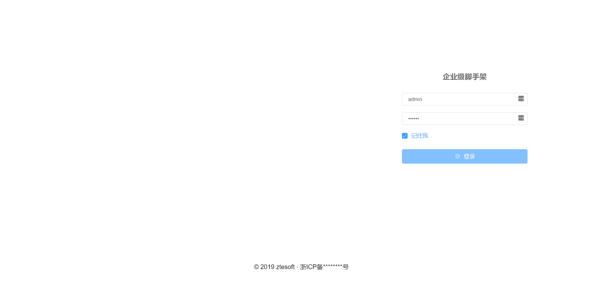
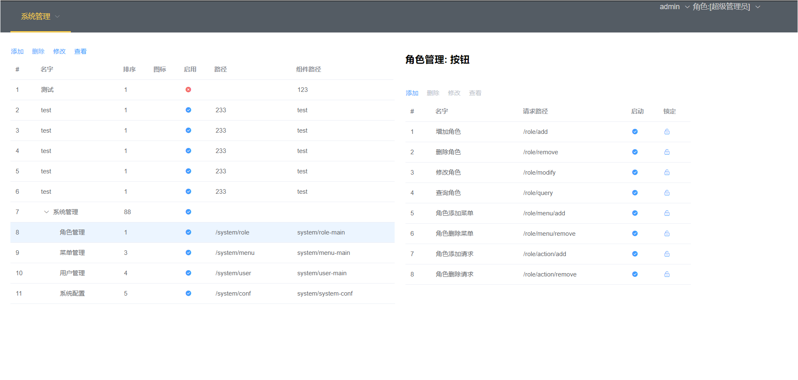
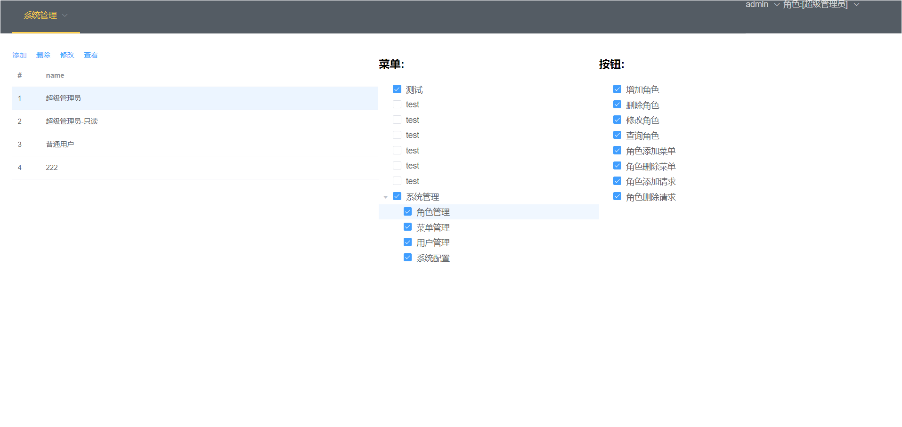

- [示例](#Demo)
- [项目背景](#background)
- [技术相关](#TechnologyStack)
- [License](#license)

## Demo
    

    

    

## background

开发一个项目，需要很多辅助功能。比如用户登录注册，菜单管理，权限管理等。本项目
使用目前主流技术完成一些项目辅助功能。使开发者更专注自己的核心功能。

## TechnologyStack

+ 前端技术栈
    * [vue](https://cn.vuejs.org/v2/guide/)
    * [webpack](https://www.webpackjs.com/concepts/)
    * [element 2.13](https://element.eleme.cn/2.13/#/zh-CN/component/installation)
+ 后端技术栈
    * springBoot
    * mybatis(xml配置sql)
    * mySql 数据库
    * springSecurity
+ 项目技术实现
    * maven构建工具
    * RBAC用户角色权限设计方案，权限控制到了按钮级别。
    * 多数据源支持，开发者可以很容易添加多数据源。
    * 使用springSecurity 满足普通项目的安全需求(防止csrf攻击...)。
    * 数据库写入使用乐观锁防止并发导致数据丢失。
    

    
    
